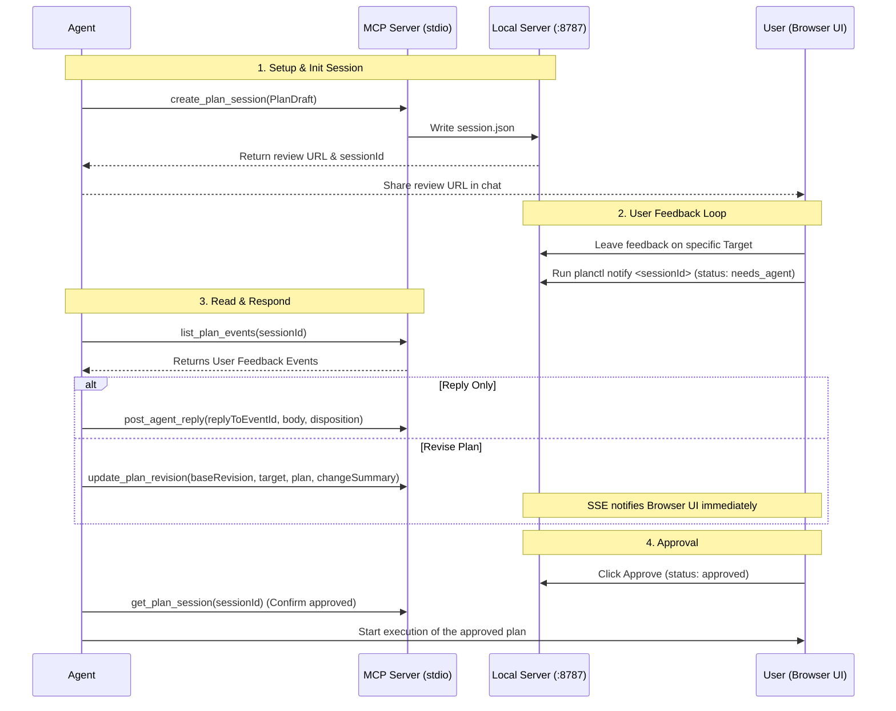

# AI Agent Integration Guide for Agent GUI (Local Environment)

이 가이드는 AI 에이전트(예: Codex, Claude)가 `Agent GUI` 웹서버 및 MCP 서버를 활용하여 사용자에게 구현 계획(Plan)을 제공하고, 피드백을 수신하며, 계획을 지속적으로 업데이트(Revision)하여 최종 승인(Approval)을 받기까지의 상호작용 프로토콜을 규정합니다.

---

## 1. Concept & Architecture

`Agent GUI`는 텍스트 채팅만으로는 전달하기 어려운 복잡한 개발 계획, 아키텍처 결정 사항, UX 및 UI 프로토타입을 **브라우저 전용 UI** 상에서 검토할 수 있도록 하는 도구입니다.



---

## 2. Local Environment Setup

현재 이 시스템은 로컬 환경에서 단일 서버로 실행됩니다.

### 2.1. 웹 서버 및 백엔드 실행
프로젝트 루트 디렉토리에서 다음 명령어로 서버를 구동합니다.
```bash
pnpm install
pnpm dev
```
* 서버는 기본적으로 `http://localhost:8787`에서 구동됩니다.
* 이 웹 서버는 Frontend UI 제공, API 라우팅, SSE(Server-Sent Events) 스트림 및 파일 기반 데이터 스토리지를 담당합니다.

### 2.2. 에이전트에 MCP 서버 등록
에이전트가 MCP(Model Context Protocol) 툴을 호출할 수 있도록 설정 파일에 아래 세팅을 추가합니다.

* **설정 파일 경로 (예: Claude Desktop)**: `~/Library/Application Support/Claude/claude_desktop_config.json`
* **설정 파일 경로 (예: Codex)**: `~/.codex/config.toml`

#### `config.toml` (Codex 예시)
```toml
[mcp_servers.agent-gui-plan-review]
command = "pnpm"
args = [
  "--dir", "/Users/jsp1226/MIDAS/agent-gui", 
  "--filter", "@agent-gui/server", 
  "exec", "tsx", "src/mcp/stdioServer.ts"
]
```

#### `claude_desktop_config.json` (Claude Desktop 예시)
```json
{
  "mcpServers": {
    "agent-gui-plan-review": {
      "command": "pnpm",
      "args": [
        "--dir", "/Users/jsp1226/MIDAS/agent-gui",
        "--filter", "@agent-gui/server",
        "exec",
        "tsx",
        "src/mcp/stdioServer.ts"
      ]
    }
  }
}
```

---

## 3. MCP Tools Reference

에이전트는 다음 6개의 핵심 MCP 툴을 통해 사용자와 대화하지 않고 백그라운드 데이터베이스를 제어합니다.

### 3.1. `create_plan_session`
새로운 계획 검토 세션을 생성합니다.
* **Input Schema**:
    * `plan`: `PlanDraft` 객체 (아래 4절의 JSON 스키마 참조)
* **Output**:
    * `sessionId`: 세션 고유 ID (예: `plan_88e7c898`)
    * `url`: 사용자가 접속할 수 있는 리뷰 UI 브라우저 주소 (`http://localhost:8787/sessions/plan_88e7c898`)
    * `revision`: 세션 초기 버전 (기본값 `1`)

### 3.2. `get_plan_session`
세션의 최신 전체 상태, 계획 구조 및 누적 이벤트를 가져옵니다.
* **Input Schema**:
    * `sessionId`: `string`
* **Output**:
    * `id`: 세션 ID
    * `status`: 현재 상태 (`draft`, `needs_agent`, `agent_replied`, `revision_ready`, `approved`, `rejected`)
    * `revision`: 현재 버전 번호 (`number`)
    * `plan`: 현재 활성화된 `PlanDraft`
    * `events`: `PlanEvent[]` (피드백, 답변, 리비전, 승인 내역 일체)

### 3.3. `list_plan_events`
세션 내에 발생한 이벤트를 가져옵니다. 증분 조회(`afterEventId`)를 지원합니다.
* **Input Schema**:
    * `sessionId`: `string`
    * `afterEventId`: (Optional) `string`. 이 이벤트 ID 이후에 발생한 이벤트만 가져옵니다.
* **Output**:
    * `events`: `PlanEvent[]`

### 3.4. `post_agent_reply`
사용자가 특정 위치에 남긴 피드백 이벤트에 답변을 작성합니다.
* **Input Schema**:
    * `sessionId`: `string`
    * `revision`: 답변을 작성하는 시점의 현재 세션 버전 (`number`)
    * `replyToEventId`: 유저 피드백의 `id` (예: `feedback_abcd1234`)
    * `target`: 피드백이 달린 타겟 (`PlanTarget`)
    * `body`: 에이전트의 답변 텍스트 (`string`)
    * `disposition`: (Optional) 피드백 처리 상태 카테고리
        * `"open"`: 아직 처리 중
        * `"answered"`: 단순 질의응답으로 완료
        * `"incorporated_in_revision"`: 수정 사항에 반영됨
        * `"rejected"`: 반영하지 않기로 결정함
        * `"needs_user_clarification"`: 사용자에게 추가 설명이 필요함

### 3.5. `update_plan_revision`
피드백을 반영하여 계획을 전면 또는 타겟 부분 수정하고 버전을 올립니다.
* **Input Schema**:
    * `sessionId`: `string`
    * `baseRevision`: 수정 기준이 되는 현재 세션 버전 (`number`). 현재 DB 버전과 일치해야 충돌이 방지됩니다.
    * `plan`: 수정이 반영된 **전체** `PlanDraft` 객체
    * `changeSummary`: 변경 사항 요약 배열 (`string[]`)
    * `target`: (Optional) 이번 수정이 집중 타겟팅한 계획 내 노드 정보 (`PlanTarget`)
    * `prototypeChanges`: (Optional) 프로토타입 수정 시 제공할 변경 이력 내역 배열

### 3.6. `mark_plan_approved`
사용자 승인을 강제로 기록해야 하거나, 특정 상황에서 에이전트가 세션을 마무리할 때 승인 이벤트를 만듭니다. (일반적으로는 사용자가 브라우저 UI에서 승인을 누름)
* **Input Schema**:
    * `sessionId`: `string`
    * `revision`: 승인 대상 버전 번호 (`number`)
    * `message`: (Optional) 승인 메시지 (`string`)

---

## 4. 핵심 데이터 JSON 스키마 (Plan & Target)

에이전트는 `create_plan_session` 및 `update_plan_revision`을 사용할 때 올바른 구조의 데이터를 생성해야 합니다.

### 4.1. `PlanTarget` (피드백/수정 타겟)
피드백이나 수정의 대상을 지칭하는 고유 키 정보입니다.
```json
{
  "type": "plan" | "phase" | "step" | "decision" | "risk" | "verification" | "prototype" | "prototype_piece",
  "id": "string" // (Optional) type이 plan이나 verification이 아닐 경우 해당 노드의 id 필수
}
```

### 4.2. `PlanDraft` (전체 계획안)
에이전트가 제출하는 전체 설계 및 구현 단계입니다.
```json
{
  "title": "구현 작업의 이름",
  "goal": "해당 태스크의 최종 목적",
  "summary": "계획 전체 요약 (선택)",
  "decisions": [
    {
      "id": "decision-1",
      "title": "설계 의사결정 제목",
      "summary": "어떤 스택이나 방식을 택했는지 요약",
      "rationale": "해당 결정을 내린 핵심 이유"
    }
  ],
  "phases": [ // (선택) 태스크를 크게 묶어주는 논리적인 묶음
    {
      "id": "phase-1",
      "title": "1단계 준비 및 설계",
      "summary": "Phase 설명",
      "stepIds": ["step-1", "step-2"]
    }
  ],
  "steps": [ // (필수) 실행할 구체적인 태스크 목록
    {
      "id": "step-1",
      "phaseId": "phase-1",
      "title": "Step 제목",
      "kind": "research" | "decision" | "code" | "test" | "checkpoint",
      "summary": "이 단계에서 구체적으로 실행할 활동 설명",
      "files": ["src/components/Button.tsx"], // 영향을 미칠 파일 경로
      "risks": ["risk-1"], // 관련된 위험 요인 ID 매핑
      "constraints": ["특수 제약사항"],
      "verification": ["이 단계가 끝났음을 어떻게 검증할지 정의"]
    }
  ],
  "risks": [ // (선택) 발생 가능한 문제점과 완화책
    {
      "id": "risk-1",
      "title": "의존성 충돌 위험",
      "severity": "low" | "medium" | "high",
      "description": "이유 설명",
      "mitigation": "우회 혹은 해결 방안"
    }
  ],
  "verification": [ // (선택) 전체 완료 검증 조건
    "E2E 테스트 성공",
    "빌드 통과"
  ],
  "prototypes": [ // (선택) 계획에 연결된 외부 URL preview 묶음
    {
      "id": "proto-main",
      "revision": 1,
      "title": "메인 페이지 preview",
      "summary": "사용자가 띄운 웹앱 URL을 탭으로 보여주는 preview",
      "kind": "wireframe" | "mockup" | "flow" | "interaction",
      "links": [
        {
          "target": { "type": "step", "id": "step-1" },
          "purpose": "explains" | "validates" | "alternative" | "final_candidate"
        }
      ],
      "tabs": [
        {
          "id": "local-app",
          "title": "Local app",
          "url": "http://localhost:3000",
          "summary": "로컬에서 실행 중인 대상 웹앱"
        }
      ],
      "state": {}
    }
  ]
}
```

Prototype은 내부 React component 구조를 표현하지 않습니다. `tabs`는 외부 URL 목록이고, 각 URL 내부의 UI 구성은 해당 웹앱이 책임집니다. 대신 prototype 자체는 계획의 산출물이므로 `id`, `title`, `links`를 유지해야 하며, `links`로 어떤 step/decision/phase를 설명하거나 검증하는지 명시합니다.

---

## 5. 에이전트의 워크플로우 가이드라인 (라이프사이클)

에이전트는 사용자와 협업할 때 다음 단계를 엄격히 준수해야 합니다.

### 5.1. [1단계] 계획 수립 및 등록
1. 사용자가 요구사항(예: "로그인 페이지 추가해줘")을 제시하면 코드를 즉시 변경하기 전에 작업을 설계합니다.
2. `PlanDraft` 포맷에 따라 작업 단계(`steps`), 설계 결정(`decisions`), 예상되는 위험 요소(`risks`)를 상세히 기술합니다.
3. `create_plan_session` MCP 도구를 호출해 세션을 생성합니다.
4. 응답으로 받은 **리뷰 웹 UI 링크**를 대화방에 출력하며 사용자에게 리뷰를 정중히 요청합니다.
    * *안내 메시지 템플릿*: `"계획 수립이 완료되었습니다. 아래 브라우저 UI에서 상세 내용을 검토하고 피드백을 남겨주세요: http://localhost:8787/sessions/plan_xxxx"`

### 5.2. [2단계] 피드백 대기 및 수신
1. 사용자는 브라우저에서 특정 단계(Step)나 전체 계획을 선택하고 코멘트를 남깁니다.
2. 피드백을 모두 작성한 유저가 CLI 또는 시스템을 통해 알림을 보냅니다. (이때 로컬 환경에서는 `pnpm planctl notify <sessionId>`가 작동하여 세션의 `status`가 `"needs_agent"`로 변환됩니다.)
3. 에이전트는 주기적으로 상태를 모니터링하거나, 사용자가 피드백 완료를 알리면 `list_plan_events`를 사용해 최신 피드백 목록을 조회합니다.

### 5.3. [3단계] 피드백 처리 (답변 & 수정)
* **단순 해명 또는 사용자 질의**:
    * 계획은 바꾸지 않고 설명만 필요한 경우, `post_agent_reply`를 통해 특정 피드백 ID 아래에 스레드 형태로 답글을 답니다. `disposition` 상태를 적절히 설정합니다 (예: `"answered"` 또는 `"needs_user_clarification"`).
* **설계 및 계획 수정 요구**:
    * 피드백 내용을 수용하여 계획을 변경하는 경우, 수정된 `PlanDraft`를 작성합니다.
    * `update_plan_revision`을 호출해 새로운 리비전(Revision)을 제출합니다. 이때 `changeSummary`에 바뀐 점을 반드시 정리해 주어 사용자가 UI 상에서 변경 전/후를 빠르게 볼 수 있게 유도합니다.

### 5.4. [4단계] 최종 승인 획득 및 코드 작성
1. 사용자가 수정된 리비전을 검토하고 브라우저에서 **"Approve(승인)"** 버튼을 누르면 세션이 `"approved"` 상태로 완료됩니다.
2. 에이전트는 `get_plan_session`을 호출하거나 이벤트를 읽어 상태가 `"approved"`가 되었음을 확인합니다.
3. 승인된 계획에 지정된 단계(`steps`)와 파일들(`files`)을 기반으로 **실제 코드 구현 작업에 착수**합니다.
