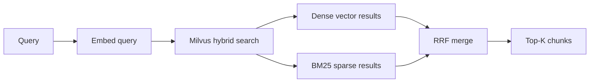
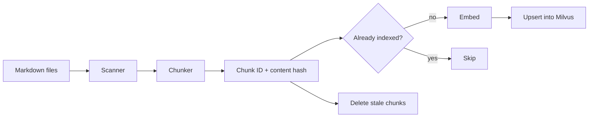

# Architecture

`mem` is a conservative port of the `mem` search engine. The package keeps
the search-quality-critical pipeline and removes non-search features such as
file watching, LLM compaction, and platform plugin packaging.

## Search Flow



Search combines dense embedding similarity with BM25 sparse retrieval. Milvus
returns both result sets and the application merges rankings with Reciprocal
Rank Fusion. This parity with `mem` is the core Phase 10 requirement.

## Ingest Flow



Markdown is the source of truth. Milvus is a derived index and can be rebuilt
from source files at any time.

## Chunking

The chunker uses markdown headings as semantic boundaries. Content before the
first heading is treated as a preamble chunk. Oversized heading sections are
split at paragraph boundaries, with configurable line overlap.

Chunk metadata includes:

| Field | Description |
| --- | --- |
| `content` | Raw chunk text. |
| `source` | Absolute source file path. |
| `heading` | Nearest heading text. |
| `heading_level` | Heading depth, or `0` for preamble. |
| `start_line` | First source line. |
| `end_line` | Last source line. |
| `content_hash` | Truncated SHA-256 hash of chunk content. |

## Deduplication

Chunk identity is content-addressed. The composite input includes source path,
line range, content hash, and embedding model. This prevents duplicate rows and
avoids unnecessary embedding calls when unchanged files are indexed repeatedly.

Stale chunks are removed when a source file is re-indexed and its current chunk
IDs no longer include previously stored IDs.

## Milvus Schema

The collection stores both dense and sparse search fields:

| Field | Purpose |
| --- | --- |
| `chunk_hash` | Primary key. |
| `embedding` | Dense embedding vector. |
| `content` | Raw text and BM25 input. |
| `sparse_vector` | Milvus BM25 sparse vector. |
| `source` | Source path. |
| `heading` | Heading label. |
| `heading_level` | Heading depth. |
| `start_line` | Source start line. |
| `end_line` | Source end line. |
| `metadata_json` | Optional full metadata payload, when metadata is configured. |
| `meta_<field>` | Optional scalar fields for filterable metadata. |

## Metadata Injection

`mem`은 특정 프로젝트의 문서 체계를 직접 알지 않습니다. 프로젝트는
`.mem/mem.toml` 또는 어댑터 코드에서 metadata field와 extractor를 설정으로
주입합니다. `mem`은 설정된 extractor contract만 알고, extractor가 반환한 dict를
chunk record에 저장합니다.

```text
markdown source
  -> chunking
  -> extractor(source_path) 호출
  -> metadata dict 정규화
  -> metadata_json / meta_<field> 저장
  -> Milvus upsert
```

extractor contract:

```python
def metadata_for_path(source: str) -> dict[str, str]:
    ...
```

Filterable metadata field는 Milvus scalar field `meta_<field>`가 됩니다.
`mem search --filter key=value`는 key를 설정 schema와 대조한 뒤 Milvus
expression으로 변환하여 dense vector 검색과 BM25 검색 양쪽에 같은 조건으로
전달합니다.

metadata는 검색 시점에 다시 계산되지 않습니다. 인덱싱 시점에 materialize되므로
metadata field 정의, filterable 여부, extractor 규칙이 바뀌면 reset/reindex가
필요합니다.

inAX에서는 이 contract를 `.mem/metadata.py`가 구현합니다. 예를 들어
`docs_generated/domains/skills-system/prd.md` 경로는 inAX extractor에 의해
`authority_layer=generated`, `doc_domain=skills-system`, `doc_kind=prd`로
해석됩니다. `mem`은 이 값의 의미를 모르고 저장과 필터링만 수행합니다.

## Configuration

The retained config model is:

```text
defaults -> ~/.mem/config.toml -> .mem/mem.toml -> CLI flags
```

Retained sections are `milvus`, `embedding`, `chunking`, and `reranker`.

## Removed Scope

The upstream `watch` and `compact` cycles are intentionally out of scope for
Phase 10. Automatic capture, summarization, prompt management, and agent hooks
belong to the surrounding memory system, not to the search engine package.
